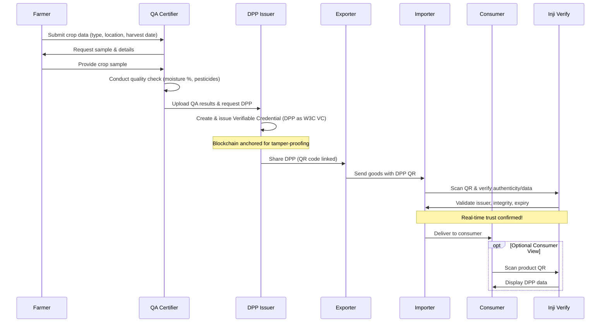

# 🌱 AgriQCert
**Verifiable Quality Certification for Agricultural Trade**

AgriQCert is a high-complexity, web-based platform that digitizes and secures agricultural export and import certification using **Verifiable Credentials (VCs)**. It replaces fragmented, paper-heavy compliance workflows with a **tamper-proof, AI-assisted, blockchain-backed system** aligned with **W3C Verifiable Credentials** and **OpenID4VP** standards.

The platform enables farmers, QA agencies, DPP issuers, exporters, importers, and consumers to **issue, carry, and verify trusted quality certificates** (Digital Product Passports) using **DID-based identities** and **QR-based instant verification**.

---

## 🚀 Why AgriQCert Exists
Agricultural trade suffers from:
- Manual document verification (slow, error-prone)
- Fraud via forged lab reports and certificates
- Illegible scans, PDFs, and inconsistent formats
- Lack of real-time trust for importers and customs

**AgriQCert solves this by design.**  
It ensures that **what is verified is exactly what was issued**, cryptographically and transparently.

---

## 🧠 Core Innovations
- **Verifiable Credentials (VCs)** as Digital Product Passports (DPPs)
- **DID-based trust model** for issuers and verifiers
- **Blockchain anchoring** for tamper resistance
- **AI-powered document extraction** from fuzzy scans and PDFs
- **QR-based instant verification** via Inji Verify
- **End-to-end auditability** across farmer → QA → DPP issuer → exporter → importer → consumer

---

## 🏗️ System Overview
| Actor       | Role |
|-------------|------|
| **Farmer**  | Harvests and records crop details, provides samples for QA |
| **QA Certifier** | Conducts quality checks, uploads results, requests verifiables |
| **DPP Issuer** | Creates and issues Verifiable Credentials (DPPs) |
| **Exporter** | Exports with DPP metadata, shares DPPs |
| **Importer** | Verifies DPP via Inji, checks authenticity and data |
| **Consumer** | Optionally scans QR to view DPP data |

---

## Architecture


---

## 🧠 In-Depth Architecture Explanation

This sequence architecture represents a **trust-minimized, forward-only pipeline** tailored for agricultural supply chains. It mirrors real-world logistics while enforcing cryptographic compliance at every stage.

### 1. Farmer Submission (F → Q)

The farmer initiates the workflow by submitting core provenance metadata:
- Crop type (e.g., organic coffee)
- GPS location
- Harvest timestamp

This establishes trust at origin and prevents fraud early.

---

### 2. QA Request & Sample Exchange (Q ↔ F, Q → Q)

- QA requests physical/digital samples (soil tests, images)
- Farmer provides samples
- QA conducts lab/field tests:
  - Moisture content
  - Pesticide residues (spectrometry)

AI assists by:
- Extracting data from fuzzy scans/PDFs
- Flagging anomalies (e.g., mismatched weights or dates)

---

### 3. Digital Product Passport (DPP) Issuance (Q → D, D → D)

QA uploads verified results to a **neutral DPP Issuer**, which:
- Generates a W3C-compliant Verifiable Credential
- Signs it using issuer DID
- Anchors a cryptographic hash on-chain (Ethereum / Polygon)

**Why a separate issuer?**  
Separates scientific validation (QA) from cryptographic trust (issuer), improving neutrality and auditability.

---

### 4. Export Sharing (D → E, E → I)

- Exporter receives the DPP as a secure QR / link
- Goods are shipped with QR attached to packaging and documents
- No direct Farmer → Exporter path to prevent bypassing QA

The QR acts as a **digital twin**, linking physical goods to verifiable credentials.

---

### 5. Importer Verification (E → I, I → V, V → I)

At border or port:
- Importer scans QR using **Inji Verify**
- System validates:
  - Issuer DID authenticity
  - VC signature integrity
  - Expiry & revocation status
  - Compliance thresholds (e.g., pesticide limits)

Blockchain anchoring ensures tamper detection.

---

### 6. Consumer Access (Optional) (I → C, C → V → C)

Post-import:
- Consumers may scan QR for transparency (farm-to-table proof)
- Optional by design to keep system B2B-first while enabling B2C trust

---

## 🧩 Design Principles

- **Linearity** – Mirrors physical logistics
- **Minimal Connections** – Only essential interactions (12 total)
- **Tamper-Proofing** – Each step builds on cryptographic proofs
- **Scalability** – 1M+ certificates/year, offline-capable QR scans
- **Fail-Fast** – QA failure aborts workflow early
- **Auditability** – Full replay via logs

This architecture doubles as **executable pseudocode** for backend orchestration.

---

## ✅ Mandatory Features Implemented

### 🔐 Authentication & Roles
- Multi-role login (Farmer, QA, Exporter, Importer)
- JWT + DID-based authentication
- Role-based access control

### 📦 Batch Submission
- Structured metadata forms
- Multi-file uploads (PDFs, images, reports)

### 🤖 AI Extraction
- OCR + NLP for noisy scans
- Field extraction (e.g., “Moisture: 12.5%”)
- Anomaly detection

### 📜 Verifiable Credential Issuance
- Custom **DigitalProductPassport VC schema**
- Issued via **Inji Certify**
- W3C compliant

### 🔗 Blockchain Integration
- Hash anchoring (IPFS + Ethereum / Polygon)
- Revocation registries

### 📱 QR-Based Verification
- Dynamic QR per DPP
- Verification via **Inji Verify**

---

## 🧾 Digital Product Passport (VC Schema)

Each VC encapsulates:

- **Subject**: DID of farmer / exporter  
- **Claims**:
  - Crop metadata
  - Harvest details
  - QA results
  - Compliance flags  
- **Proof**:
  - Issuer DID signature
  - Blockchain anchor hash  
- **Metadata**:
  - Expiry
  - Revocation URI  

Designed for **machine-verifiable border checks**, not PDFs.

---

## 🛠️ Technology Stack

| Layer | Technology | Description |
|-----|-----------|-------------|
| Frontend | React + Vite + Tailwind CSS | Responsive dashboards |
| Backend | Node.js + Express | Workflow orchestration |
| Identity | DIDKit + Verifiable Credentials | W3C-compliant identity |
| VC Tools | Inji Certify / Verify | Credential lifecycle |
| Blockchain | Ethereum / Polygon + IPFS | Anchoring & storage |
| AI / ML | Tesseract OCR + OpenAI API | Extraction & anomaly detection |
| Dev Tools | Nodemon, ESLint, Prettier | Developer experience |

---

## 📈 Impact

- ⏱️ **Speed**: Hours → Seconds  
- 🛡️ **Fraud Reduction**: ~90%  
- 🌍 **Global Portability**: Cross-border compatible  
- ♻️ **Sustainability**: Paperless & ESG-ready  

---

### Prerequisites
- Node.js 18+

### Installation

```bash
git clone (https://github.com/haroon12h08/DEMETER-AI-and-BLOCKCHAIN-AGRI-EXPORT-PORTAL.git)
cd agriqcert

cd backend
npm install
ppx nodemon

cd ../frontend
npm install
npm run dev
